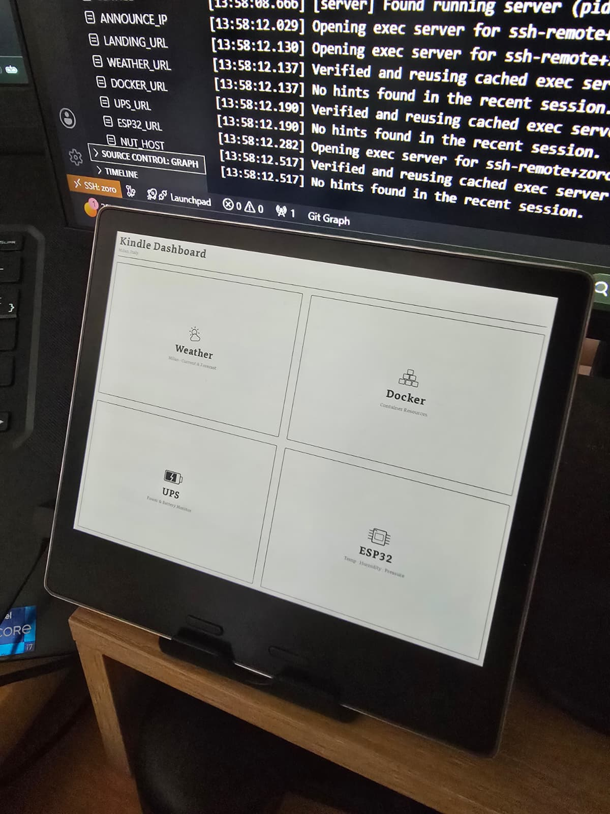
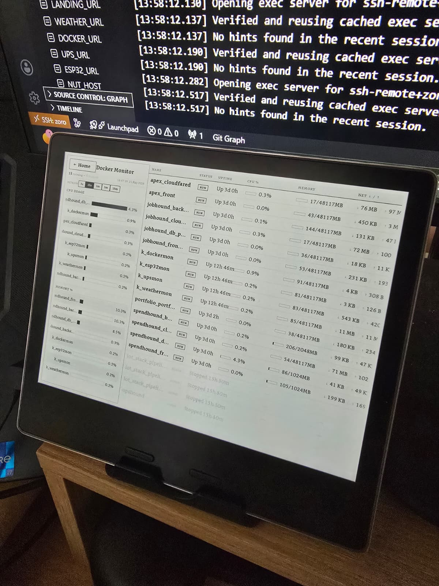
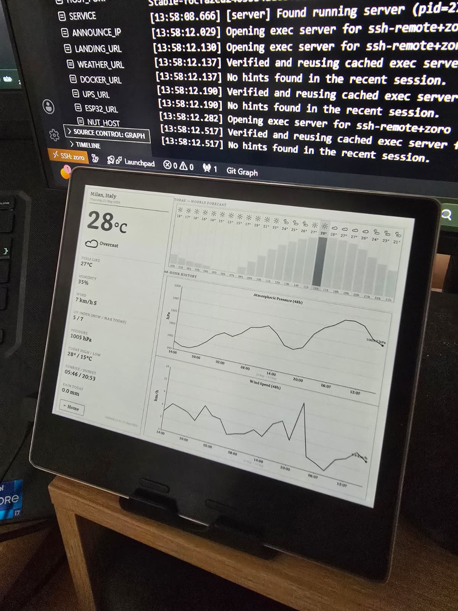
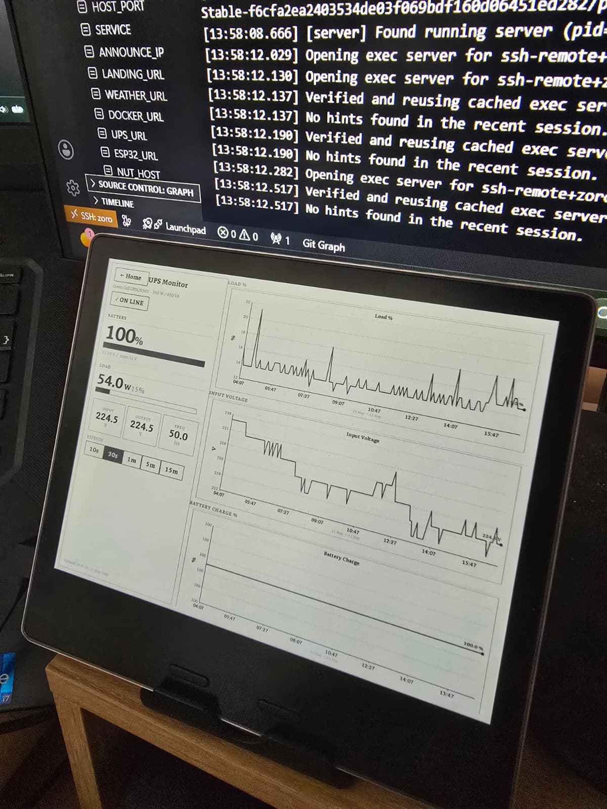

# Kindle Dashboard

A FastAPI web application for a Kindle Oasis 3 (10th gen) e-ink display.
Pages are server-rendered, grayscale-safe, and designed to fill the Oasis 3's px viewport exactly.

## Screenshots

### Dashboard


### Docker containers monitor


### Weather


### UPS monitor 


## Requirements

### Server
- Python 3.11+ (or Docker)
- A machine on your LAN running the server
- Docker daemon running locally (optional — /docker page degrades gracefully)

### Kindle
- **Jailbroken Kindle** — a stock Kindle cannot run arbitrary browser apps
  - Follow the [MobileRead guide](https://www.mobileread.com/forums/showthread.php?t=320564) for your firmware version. Also, [this video](https://www.youtube.com/watch?v=l4ZliC82RtA)
- **KUAL** (Kindle Unified Application Launcher) installed post-jailbreak 
- **Shortcut Browser** launches a full-screen Chromium instance pointed at a URL. [Link](https://github.com/mitchellurgero/kindle-shortcut-browser)

## Setup

```bash
cd kindle_repurposed
python -m venv .venv
source .venv/bin/activate      # Windows: .venv\Scripts\activate
pip install -r requirements.txt
```

## Run

```bash
python -m app.main
```

Or with uvicorn directly:

```bash
uvicorn app.main:app --host 0.0.0.0 --port 8080
```

On startup you'll see:

```
  Open on Kindle:  http://192.168.1.37:8080/weather
```

## Endpoints

| URL | Description | Refresh |
|-----|-------------|---------|
| `/` | Index with nav buttons | — |
| `/weather` | Milan weather dashboard | 5 min |
| `/docker` | Docker container status | 30 sec |

## Kindle / Shortcut Browser setup

In your KUAL Shortcut Browser config, set:

```
FULLSCREEN_SITE=http://192.168.1.37:8080/weather
```

The browser is launched with `--content-shell-host-window-cord=0,215` which offsets
the viewport by 215 px to account for the Kindle UI bar — the app is designed for
the resulting 1264×1465 px viewport.

## Windows startup (optional)

To start the server automatically when your PC boots, create a scheduled task or
add a `.bat` file to `shell:startup`:

```bat
@echo off
cd /d C:\path\to\kindle_repurposed
.venv\Scripts\python.exe -m app.main
```

Or use NSSM to wrap uvicorn as a Windows service.

## Data sources

- **Weather**: [Open-Meteo](https://open-meteo.com/) — free, no API key needed
- **Docker**: local Docker daemon via the Python `docker` SDK
